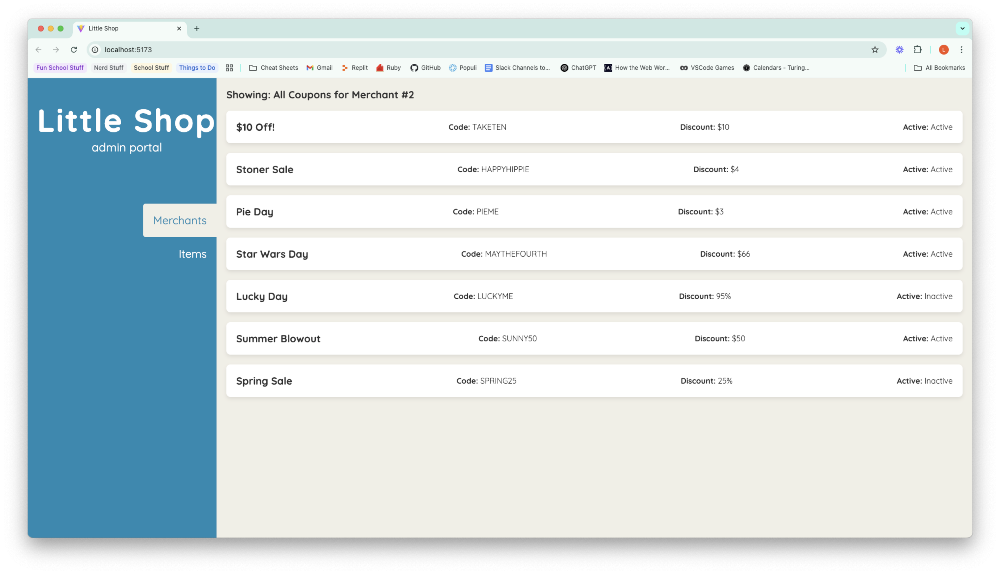

______________________________________________________  

# Hang in There  

Link to your GitHub. Consider also providing LinkedIn link

[GitHub](https://github.com/ldsauer)

[LinkedIn](https://www.linkedin.com/in/ldsauer/)

### Abstract:
(Briefly describe what you built and its features. What problem is the app solving? How does this application solve that problem?)

- In this project we built more features to our little shop project. We built the ability to add coupons to merchants with either a dollar or percent off. 
- We also made sure that a merchant can't have more than one of the same coupon and also no more than 5 active coupons per merchant. 
- The problem this app is solving is it allows merchants to offer thier products at a cheaper rate, hopefully bringing in more customers and revenue. 

### Installation Instructions:
(What steps does a person have to take to get your app cloned down and running?)
- To get the app cloned down and running you would need to to go my Github profile, go to my repositories, and then go into both the little-shop-be-final-starter and little-shop-fe-final-starter. For each one you need to clone with the SSH code and then clone that onto your local in whichever directory you want it in. But you need to make sure that the front end is not inside your back end and vise versa. Once you have them you will need to run `rails s` on the back end and then `npm run dev` on the front end so they can communicate with eachother. 

### Preview of App:
(Provide ONE gif or screenshot of your application - choose the "coolest" piece of functionality to show off. gifs preferred!)
- 

### Context:
(Give some context for the project here. How long did you have to work on it? What specific work/improvements did you contribute to this FE application?)
- This project was very tough. I spent a lot more time on it than I thought. I did not think it was going to be so intensive so I definitely slacked the first few days which I wish I had not done. I did learn a whole lot from this project though. I had never really set up a lot of the API stuff on the back end so it was really educational to work mostly on that and get the practice and understanding that I was lacking. 
- As far as the front end I just triend to make it match up with the rest of the website. It was super easy as far as the CSS goes, I jsut needed to add the newley created .coupon-card class to the existing .item and .merchant CSS. JS wasn't too bad either. Just had to add a bit more to be able to access and display what we were wanting. 

### Learning Goals:
(What were the learning goals of this project? What tech did you work with?)
- Learning goals were to get a better understanding of building more functionality into an already existing API and then also implementing them to the front end so that we can use the functionality in a real world case. 
- The tech I worked with was Vite, Google, RubyonRails guide, chatGPT, and Slack. 

### Wins + Challenges:
(What are 2-3 wins you have from this project? What were some challenges you faced - and how did you get over them?)
- Biggest win was getting the project close to done. There was awhile there where I did not think I was going to be able to complete it. 
- Another big one is how much of the simplecov I was able to get completed. It has always been very intimidating to me but as I was tackling it, it's not so bad when you just take it line by line to make sure you are writing all your tests. 
